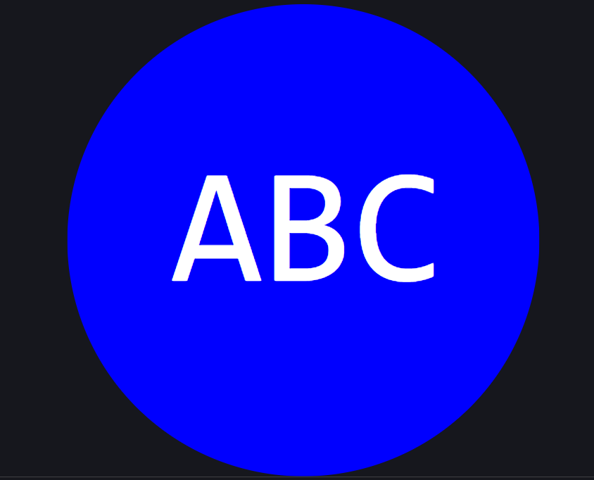

# 10 Object-oriented Programming: SVG Logo Maker

## Task

Our task is to build a Node.js command-line application that prompts user input to generate a logo and save it as an SVG file. The user is prompted to provide 3 text characters, select a shape, and select color for the text and shape to create a logo. When the user is finished with the prompt, a generated logo is created and saved to an `.svg` file.

## Walkthrough Video:

Refer to this [Video](https://drive.google.com/file/d/1HCmn4bqqFfnTz0-y3bJqG6B-KvuUZpEO/view) to see a walkthrough video. This will demonstrate the functionality of the application and that this passes all tests.

## Link to GitHub

- [GitHub](https://github.com/charmingdarling/svglogomaker)

## User Story

```md
AS a freelance web developer
I WANT to generate a simple logo for my projects
SO THAT I don't have to pay a graphic designer
```

## Acceptance Criteria

```md
GIVEN a command-line application that accepts user input
WHEN I am prompted for text
THEN I can enter up to three characters
WHEN I am prompted for the text color
THEN I can enter a color keyword (OR a hexadecimal number)
WHEN I am prompted for a shape
THEN I am presented with a list of shapes to choose from: circle, triangle, and square
WHEN I am prompted for the shape's color
THEN I can enter a color keyword (OR a hexadecimal number)
WHEN I have entered input for all the prompts
THEN an SVG file is created named `logo.svg`
AND the output text "Generated logo.svg" is printed in the command line
WHEN I open the `logo.svg` file in a browser
THEN I am shown a pixel image that matches the criteria I entered
```

## How to Use

Please open the terminal and input:

```
node index.js
```

## Mock-Up

The following images shows an example of the generated SVG given the following input entered by the user: `ABC` for the text, `white` for the text color, `circle` from the list of shapes, and `blue` for the shape color. This is an image of the output SVG and not the SVG file itself:



## Installation Requirements

- Uses the [Node.JS](https://node.js.org/)
- Uses the [Inquirer package](https://www.npmjs.com/package/inquirer/v/8.2.4) - Prompting User
- Uses the [Jest package](https://www.npmjs.com/package/jest) - Running Tests
